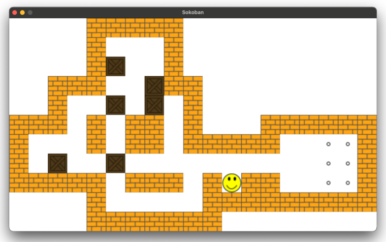

# EPFL CIVIL-127, Lab 4

## March 11, 2025

This lab is graded. Please turn in the solutions no later than Friday, March 14th, 2025, 6pm.

We should explain how to submit solutions. We’ll want something like username.zip or username.tar.gz. The structure of the archive should be:  
civil-127/exercise_4_1/  
civil-127/exercise_4_2/  
civil-127/exercise_4_3/  
civil-127/levels/level1.xsb (you can include additional levels if you want)  
civil-127/assets/\<various svg files\>

And then upload the archive to moodle (see lab 4 upload activity).

## Exercise 4.1

Implement a Cal class which provides a function to print a calendar’s month view. The only import you are allowed to use for this exercise is “datetime”. Write tests for this class.

`c = Cal()`  
`c.year(2025)`  
`c.month("jan")`  
`c.week_start("sun")`  
`c.print()` should print, with the exact spacing/formatting:

```
    January 2025        
Su Mo Tu We Th Fr Sa    
          1  2  3  4    
 5  6  7  8  9 10 11    
12 13 14 15 16 17 18    
19 20 21 22 23 24 25    
26 27 28 29 30 31    
```

`c = Cal()`  
`c.month("aug")`  
`c.year(2025)`  
`c.print()` should print, with the exact spacing/formatting:

```
    August 2025  
Mo Tu We Th Fr Sa Su  
             1  2  3  
 4  5  6  7  8  9 10  
11 12 13 14 15 16 17  
18 19 20 21 22 23 24  
25 26 27 28 29 30 31
```

If the year or month are not set, your `Cal` class should default to the current year and month. If `week_start` isn’t called, the default is monday.

You can use [jan\_2025.txt](https://docs.google.com/document/d/16McweJiFrERMEp1jecGnRvNy6xsHrpByjefDQAecJ9U/edit?usp=drive_link) and [aug\_2025.txt](https://docs.google.com/document/d/1GhtTgxQcpEh-x9evWOKpMQgIxpCmP7-kM2pcCv5Ge1w/edit?usp=sharing) to ensure you are formatting your output correctly.


## Exercise 4.2

Continue working on your Sokoban from labs 1, 2, and 3 or use one of the solutions from lab 3. The grading will only focus on the new code you are adding for this exercise. Implement checking that the level is completed. The level is completed when all the goals are covered by a box. When the player has completed the level, you can `print(“success”)` and exit your game loop.

Add a test to confirm that you have implemented this new feature correctly.

## Exercise 4.3

Make a copy of your Sokoban from exercise 4.2. Implement a graphical interface for your game using pygame. Refer to this week’s slides for additional information about pygame.

Use `pip install pygame==2.6.1` to ensure you have the latest version.Note : for most windows users in this class the command would be `<Path/to/python3.12.9/interpreter> -m pip install pygame`

You can check that you have the correct setup by checking:

- `python --version`  
- `pip show pygame` should return "Version: 2.6.1"

We have provided you with graphical [assets](https://drive.google.com/drive/folders/1HYFb_NIcmqssglgFQJqI0wCyRWbDvQ6g?usp=sharing) but you are welcome to create your own graphics. Once your pygame version of the game works, please cleanup your code and remove any unnecessary parts (e.g. you don’t need code to print the board to stdout, so you can remove that).

Writing tests for this part is optional.

Congratulations, you now have a fully functional Sokoban game! Your game should look like:

